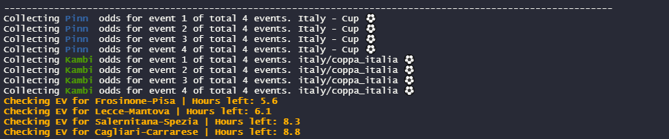
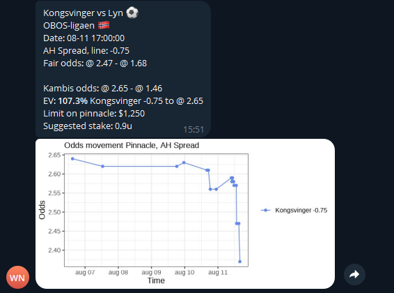

# EV-betting
A preview of my program that detects odds outliers on the odds provider Kambi by comparing their odds with those from Pinnacle.  
The program operates on the assumption that Pinnacle's odds are sharp and most accurately reflect the true probabilities.

When predetermined criteria are met (minimum EV, maximum odds, minimum limit on Pinnacle etc.) a telegram message is sent out. 
Right now it takes about 0.6 seconds to compare a single match.

Currently, the program can compare odds for three sports: ⚽ Football, ⚾ Baseball, and 🏉 Rugby League.

